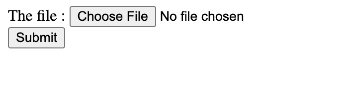

# Image Processing Task

## Cloning the repository
To clone the repository run the following command:
```bash
$ git clone https://github.com/therohim/image-processing.git
```
 
 ## How To Run the Project
 Run in your terminal this command
 ```bash
 make server-start
 ```
 or 
 ```bash
 go run main.go
 ```
 After you clone the repository, you can open the project with link below and upload your image. After image uploaded you can see in folder images in project and see your image uploaded
 ```bash
 http://localhost:3000/upload
 ```
 
 
 Run unit test resize and change dimensions images with command below
 ```bash
 go test -v -timeout 30s -run ^TestResizeImage$ (your-directory)-test/utils
 ```
